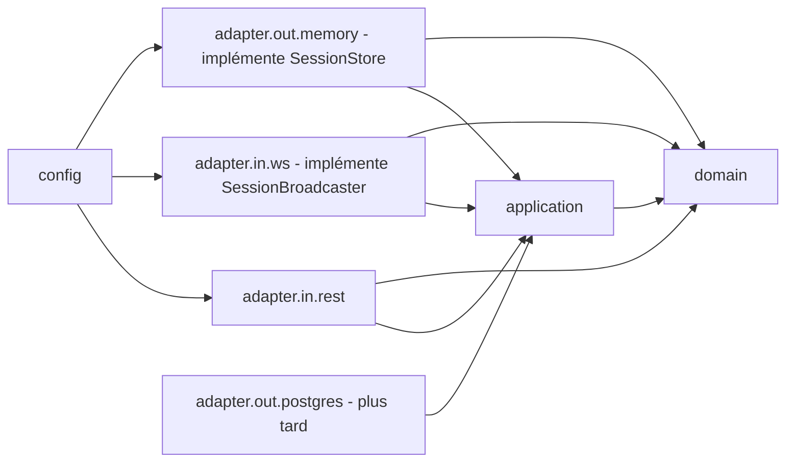
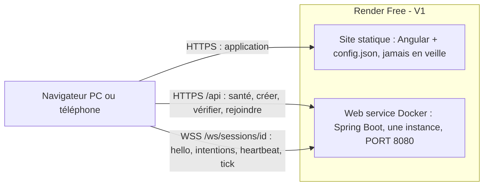
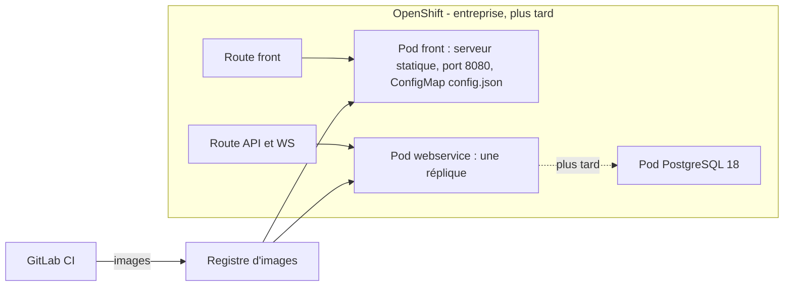
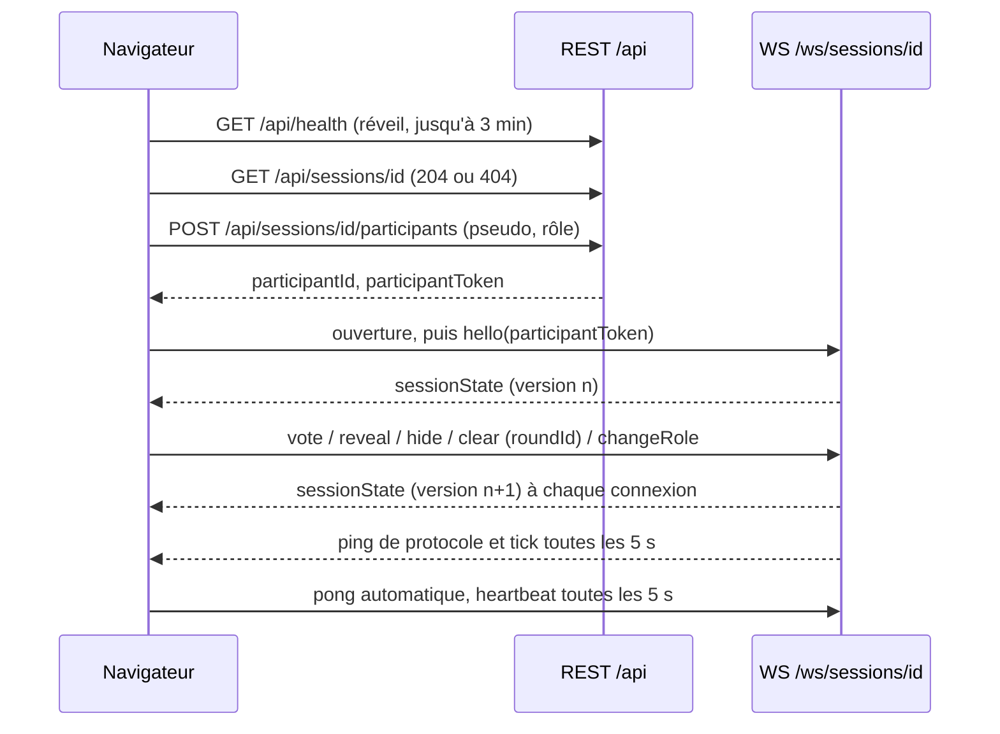

# Architecture Spine : Planning Poker pour ateliers d'affinage

## Design Paradigm

**Webservice hexagonal** (ports et adaptateurs). **Le serveur fait autorité sur l'état**, et le front n'en est qu'un **reflet** qui affiche des instantanés.

| Couche | Paquet Java (`com.planningpoker`) | Contenu | Peut dépendre de |
| --- | --- | --- | --- |
| Domaine | `domain` | Session, Participant, Round, Card, règles (FR-2, FR-5, FR-7 à FR-15), synthèse (FR-14), construction de l'instantané filtré par destinataire | rien (Java pur) |
| Application | `application` | cas d'usage (créer, rejoindre, se connecter, voter, révéler, masquer, effacer, changer de rôle, se déconnecter), balayeur des délais, ports `SessionStore` et `SessionBroadcaster`, `java.time.Clock` | `domain` |
| Adaptateurs entrants | `adapter.in.rest`, `adapter.in.ws` | contrôleurs REST, gestionnaire WebSocket, sérialisation JSON du contrat, **registre des connexions** (implémente `SessionBroadcaster`) | `application`, `domain` |
| Adaptateurs sortants | `adapter.out.memory` (V1), `adapter.out.postgres` (plus tard) | implémentations de `SessionStore` | `application`, `domain` |
| Configuration | `config` | assemblage Spring, CORS, origines WebSocket, planificateur, `Clock` en UTC | tout |



La flèche se lit « dépend de ». `domain` ne dépend de rien. Les ports sont déclarés dans `application`, et les adaptateurs les implémentent.

## Invariants & Rules

### AD-1 — Webservice hexagonal, domaine pur [ADOPTED]

- **Binds:** tout le webservice ; FR-2, FR-5, FR-7 à FR-15 ; NFR-9
- **Prevents:** des règles du jeu dupliquées ou divergentes entre le point d'entrée REST et le point d'entrée WebSocket ; un domaine lié à Spring, à Jackson ou au stockage.
- **Rule:**
  - Toutes les règles métier et tous les calculs vivent dans `domain` : normalisation du pseudo, droit de voter, verrouillage après révélation, retrait du vote d'un observateur au masquage, moyenne, plus votée, min, max, consensus, ordre des participants.
  - `domain` n'importe rien de `org.springframework..`, `tools.jackson..`, `com.fasterxml.jackson..` ou `jakarta..`.
  - Les adaptateurs traduisent le protocole et appellent un cas d'usage, sans jamais prendre de décision métier.
  - Un test ArchUnit fait échouer le build si l'une de ces dépendances interdites apparaît, ou si le sens des dépendances du schéma ci-dessus est violé.

### AD-2 — Surface fermée : quatre endpoints REST, un WebSocket brut [ADOPTED]

- **Binds:** FR-1 à FR-3, FR-5 à FR-17 ; NFR-2
- **Prevents:** des actions de séance réparties entre deux canaux (FR-17) ; des endpoints ou des protocoles inventés par chaque story ; STOMP d'un côté et WebSocket brut de l'autre.
- **Rule:** la surface réseau est **fermée**. Toute modification commence par le contrat (AD-6).
  - `GET /api/health` : réponse 200 dès que le webservice est prêt. C'est la sonde de réveil du front.
  - `POST /api/sessions` avec `{pseudo, role}` : crée la session **et** y fait entrer son créateur, puis renvoie `{sessionId, participantId, participantToken}`.
  - `GET /api/sessions/{sessionId}` : 204 si la session existe, 404 sinon. Le front l'appelle dès l'ouverture d'un lien (FR-3).
  - `POST /api/sessions/{sessionId}/participants` avec `{pseudo, role}` : rejoint la session ou reprend un pseudo (FR-8, voir AD-7), puis renvoie `{participantId, participantToken}`.
  - `WS /ws/sessions/{sessionId}` : le **seul** canal des actions faites dans une session. C'est un WebSocket **brut**, qui transporte des messages JSON définis par le contrat. **Pas de STOMP**, ni de SockJS. Cette décision remplace la recommandation STOMP de `research-stack-hosting.md`.

### AD-3 — Un seul point de mutation par session : sérialisé, versionné, sans I/O bloquante [ADOPTED]

- **Binds:** FR-16, FR-17 ; NFR-1, NFR-4
- **Prevents:** des états divergents lors d'actions simultanées ; un téléphone lent qui bloque tout le serveur ; un flot d'instantanés qui ne changent rien.
- **Rule:**
  - Toute modification d'une session, qu'elle vienne d'un cas d'usage ou du balayeur (AD-8), suit la même séquence, **sous le verrou propre à cette session** :
    1. charger la session (AD-9) ;
    2. appliquer la règle du domaine ;
    3. si l'**état observable** a changé, incrémenter `version`, puis `save` ;
    4. appeler `SessionBroadcaster.publish(session)`.
  - L'état observable est tout ce qui figure dans l'instantané (AD-5). La date de la dernière activité réseau d'une connexion **n'en fait pas partie** : la mettre à jour n'incrémente pas `version` et ne déclenche aucune diffusion.
  - `publish` ne fait **aucun envoi bloquant**. Il construit les instantanés et les place dans une file d'envoi propre à chaque connexion, bornée (`ConcurrentWebSocketSessionDecorator`, 2 s et 64 Ko). Une connexion qui déborde est fermée, et le client se reconnecte.
  - Aucun autre code ne modifie une `Session`. Les sessions ne partagent aucun verrou.

### AD-4 — Intentions nommées, idempotentes, liées au tour [ADOPTED]

- **Binds:** FR-10 à FR-13, FR-15, FR-17 ; EXPERIENCE › Barre d'action
- **Prevents:** un clic parti juste après le changement d'un autre participant, qui déclencherait une autre action que celle voulue, par exemple effacer le nouveau tour ; des intentions impossibles traitées différemment selon la story.
- **Rule:**
  - Le client envoie des intentions nommées. Il n'envoie jamais de bascule du type « inverser l'état ».
    - `vote {roundId, card}` : `card` vaut `null` pour retirer son vote.
    - `reveal {roundId}`.
    - `hide {roundId}`.
    - `clear {roundId}`.
    - `changeRole` (champ `role`).
  - `roundId` est une chaîne opaque, générée par le domaine. Elle ne change **que** lors d'un `clear`.
  - Une intention qui porte un `roundId` périmé est **ignorée silencieusement**.
  - Une intention déjà satisfaite ne change rien. Par exemple, `reveal` sur un tour déjà révélé n'incrémente pas `version` et ne produit pas d'erreur.
  - Une intention **interdite** ne change rien et renvoie `error` avec un code du contrat : `ROUND_REVEALED` pour un vote sur un tour révélé, `NOT_A_VOTER` pour un vote d'observateur, `INVALID_CARD` pour une carte inconnue.

### AD-5 — Instantanés complets, filtrés par destinataire, de forme normative [ADOPTED]

- **Binds:** FR-5 à FR-7, FR-10, FR-12, FR-14, FR-16 ; NFR-6 ; EXPERIENCE › Table, Barre d'action, Panneau de résultat
- **Prevents:** un client qui reconstruit un état différent à partir d'événements ; la fuite des votes d'un tour caché ; des champs nommés différemment par l'agent Java et l'agent Angular.
- **Rule:**
  - Après chaque changement de `version`, et **à chaque nouvelle connexion**, le serveur envoie à la connexion concernée un `sessionState` construit par le domaine pour **ce** destinataire.
  - Le squelette ci-dessous est **normatif**. Le contrat (AD-6) le précise, mais ne le contredit pas.
  - Pendant un tour caché, `vote` n'est rempli que pour le destinataire lui-même.
  - Les participants arrivent **déjà triés** par le serveur : les votants, puis les observateurs, chaque groupe par `joinOrder`. Le client se contente de remonter sa propre place en tête de son groupe (EXPERIENCE).
  - Le client remplace son état par le dernier instantané reçu, sans jamais fusionner. Au sein d'une même connexion, il ignore tout instantané dont `version` est inférieure à la sienne. À la reconnexion, il accepte le premier instantané reçu, quelle que soit sa version.

```text
sessionState {
  sessionId, version, selfParticipantId,
  round: { roundId, status: HIDDEN | REVEALED },
  participants: [ { participantId, pseudo, role: VOTER | OBSERVER, connected, joinOrder,
                    hasVoted, vote: card | null, canVoteThisRound } ],
  progress: { voted, expected },            // "N votes sur M" : expected inclut les votants déconnectés
  summary: null | { average: number | null, mostVoted: { values: [card], count } | null,
                    min: card | null, max: card | null, consensus: boolean },
  lastChange: { action: JOIN | LEAVE | VOTE | REVEAL | HIDE | CLEAR | ROLE | PRESENCE,
                byParticipantId: string | null }
}
```

  - Le blocage de 1 s du client (EXPERIENCE) ne s'applique que si `lastChange.action` vaut REVEAL, HIDE ou CLEAR **et** si `byParticipantId` n'est pas le destinataire lui-même.
  - `average` est arrondie au dixième par le domaine, avec `RoundingMode.HALF_UP`.

### AD-6 — Contrat d'abord, dans `contract/` [ADOPTED]

- **Binds:** tous les échanges entre le front et le webservice
- **Prevents:** des agents qui écrivent chacun leur version d'un message, sur deux branches en parallèle.
- **Rule:**
  - `contract/openapi.yaml` (OpenAPI 3.2) et `contract/asyncapi.yaml` (AsyncAPI 3.1) sont la **source de vérité**. Leurs charges utiles sont décrites en JSON Schema.
  - **La première story du build livre le contrat complet**, avec des exemples de chaque message, **avant** toute story qui code le front ou le webservice.
  - Toute modification ultérieure d'un message se fait dans le même changement que le code des deux côtés.
  - Les types Java et TypeScript sont **écrits à la main**. Des tests valident, des deux côtés, les exemples du contrat contre ses JSON Schema.
  - Aucun champ ne circule s'il n'est pas décrit dans le contrat.

### AD-7 — Identité : trois identifiants, un seul secret, jamais dans une URL [ADOPTED]

- **Binds:** FR-2, FR-7 à FR-9 ; NFR-6
- **Prevents:** un secret diffusé ou journalisé, qui permettrait de prendre la place d'un autre ; des reprises de pseudo ou des retours après absence gérés différemment selon la story.
- **Rule:**
  - `sessionId` : 128 bits aléatoires, encodés en base64url, présent dans le lien.
  - `participantId` : un UUID public, la seule façon de désigner un participant.
  - `participantToken` : 128 bits aléatoires. C'est un **secret**. Il n'apparaît jamais dans une URL, un instantané ou un journal.
  - Tous ces identifiants sont générés avec `SecureRandom`.
  - **Poignée de main :**
    1. le client ouvre `/ws/sessions/{sessionId}` ;
    2. son premier message doit être `hello {participantToken}`, dans les 5 s ;
    3. le serveur vérifie **d'abord la session**, et ferme la connexion en `4404` si elle n'existe pas ;
    4. il vérifie **ensuite le jeton** :
       - jeton actif : le participant est reconnecté ;
       - jeton d'un participant **retiré pour absence** (FR-9) dont le pseudo est encore libre : le participant est **remis à sa place**, avec le même `participantId`, le même pseudo et le même rôle, et reçoit un nouveau `joinOrder` ;
       - jeton inconnu ou révoqué, ou pseudo pris entre-temps : fermeture en `4401` ;
    5. enfin, il envoie l'instantané (AD-5).
  - Un jeton reste valable jusqu'à l'expiration de la session, sauf s'il est révoqué.
  - **Reprise d'un pseudo depuis un autre appareil (FR-8)** : rejoindre avec le pseudo d'un participant **déconnecté** reprend ce participant, avec le même `participantId`, son rôle et son vote. Le serveur émet un **nouveau** jeton, révoque l'ancien et ferme en `4401` toutes les connexions qui l'utilisaient encore.
  - Le jeton est rangé dans le `localStorage`, sous la clé `pp.token.{sessionId}`, partagée par les onglets. Il est supprimé dès que le client reçoit `4401` ou `4404`.

### AD-8 — Présence : l'inactivité ne déconnecte jamais [ADOPTED]

- **Binds:** FR-4, FR-7, FR-9, FR-16 ; NFR-1b ; EXPERIENCE › Reconnexion, Retour après une longue absence
- **Prevents:** un participant exclu parce qu'il écoute sans rien toucher, que son onglet est en arrière-plan (minuteries ralenties par le navigateur) ou que son téléphone est verrouillé ; un onglet fermé qui reste affiché comme connecté ; une application mise en veille par Render pendant une séance.
- **Rule:**
  - L'inactivité de l'**utilisateur** n'est jamais un critère. Seul l'état **réseau** de ses connexions compte.
  - Un participant peut avoir **plusieurs connexions**, par exemple plusieurs onglets. Il est `connected=true` tant qu'au moins une de ses connexions est ouverte et vivante. L'ouverture et la fermeture d'une connexion passent par AD-3. La **fermeture de sa dernière connexion** le passe **aussitôt** à `connected=false` (FR-16).
  - **Vivacité, mesurée par le serveur :** toutes les 5 s, le serveur envoie un **ping de protocole WebSocket**. Le navigateur y répond automatiquement, même quand l'onglet est caché ou ses minuteries ralenties. Une connexion dont ni `pong` ni message ne sont arrivés depuis **15 s** est morte et fermée. Aucune minuterie JavaScript du client n'entre dans ce calcul.
  - **Tic serveur :** toutes les 5 s, le serveur envoie aussi un message applicatif `tick` sur chaque connexion. Le client considère la connexion perdue si **aucun message** n'est arrivé depuis **12 s**, mesuré à la réception d'un message ou au retour au premier plan.
  - **Signal de vie du client :** le client envoie un message applicatif `heartbeat` toutes les 5 s. Il sert **uniquement** à garder Render éveillé (NFR-1b), car Render ne compte que le trafic entrant (messages WebSocket compris selon sa documentation, non vérifié en production). Un navigateur qui le ralentit à une fois par minute reste largement sous le seuil de veille de 15 min.
  - **Sonde HTTP de maintien :** en plus, la page de session appelle `GET /api/health` toutes les **5 min**, même pendant une reconnexion. Une requête HTTP entrante garde Render éveillé à coup sûr, même si les messages WebSocket ne comptaient pas comme trafic. Le résultat de l'appel est ignoré.
  - **Balayeur :** il passe toutes les secondes, sous AD-3.
    - Il ferme les connexions mortes.
    - Il retire un participant sans connexion depuis **5 min** (FR-9) : le participant disparaît de la liste et son vote du tour en cours est supprimé, mais son jeton reste valable pour un retour transparent (AD-7).
    - Il supprime une session **24 h** après sa création et ferme ses connexions en `4404`.
  - **Reconnexion côté client :** elle est immédiate, puis a lieu au bout de 1, 2, 4 et 8 s, puis toutes les 10 s. Elle est aussi immédiate sur `online` et sur `visibilitychange` (retour au premier plan). Le bandeau « Reconnexion… » ne s'affiche qu'après 2 s de coupure.
  - Toute lecture de l'heure passe par `java.time.Clock`, en UTC, et les délais sont des `Duration`.

### AD-9 — Stockage derrière `SessionStore`, une seule instance en V1 [ADOPTED]

- **Binds:** NFR-1, NFR-9 ; déploiement
- **Prevents:** du code qui accède directement à une collection en mémoire ; des écritures qui disparaissent au passage à PostgreSQL ; un passage à plusieurs instances qui éclaterait l'état.
- **Rule:**
  - `SessionStore` expose `find(sessionId)`, `save(session)`, `delete(sessionId)` et `all()` (pour le balayeur).
  - Toute modification suit la séquence **charger → modifier → `save`**, même si l'implémentation en mémoire n'en a pas besoin.
  - V1 : l'état vit en mémoire, dans une `ConcurrentHashMap`, avec **une seule instance** du webservice.
  - Passer à plusieurs instances exige un nouvel AD (voir Deferred).
  - Perdre les sessions lors d'un redémarrage est un risque accepté (NFR-1).

### AD-10 — Front Angular : un seul `SessionService` [ADOPTED]

- **Binds:** tout le front ; FR-6 à FR-17 ; EXPERIENCE ; DESIGN
- **Prevents:** plusieurs composants qui ouvrent chacun leur connexion ou gardent leur propre copie de l'état ; des calculs métier refaits côté front ; des jetons visuels déclarés deux fois.
- **Rule:**
  - `SessionService` est le **seul** à gérer le WebSocket : ouverture, `hello`, `heartbeat`, surveillance du `tick`, reconnexion (AD-8). Il expose l'instantané sous forme de `Signal` en lecture seule, ainsi que des méthodes d'intention (AD-4).
  - Les composants ne font que lire ce signal et appeler ces méthodes.
  - Le front ne calcule **rien** de métier. Il se limite au formatage (`LOCALE_ID` `fr`, `<html lang="fr">`) et à la présentation.
  - Les jetons de `DESIGN.md` deviennent des propriétés CSS globales qui portent le même nom. Les jetons `-dark` **redéfinissent ces mêmes propriétés** sous le thème sombre ; ils ne créent pas de propriétés `--*-dark`.

### AD-11 — Deux origines, configurées à l'exécution [ADOPTED]

- **Binds:** déploiement ; REST et WebSocket ; NFR-6
- **Prevents:** un front qui appelle une URL écrite en dur ; une API ouverte à toutes les origines ; des ressources tierces chargées par le front.
- **Rule:**
  - Au démarrage, le front lit `/config.json`, de forme `{ "apiBaseUrl": "https://…" }`. Il en déduit l'URL `wss://` du WebSocket.
  - Ce fichier est **produit par l'environnement**, pas par le code :
    - sur Render, un script du build le génère à partir de la variable `API_BASE_URL` ;
    - sur OpenShift, ce sera une ConfigMap montée dans le pod.
  - Le webservice n'accepte, en CORS comme à l'ouverture du WebSocket, que les origines listées dans `ALLOWED_ORIGINS`.
  - Le front est servi avec une CSP `default-src 'self'; connect-src 'self' <API>`, uniquement en HTTPS et WSS. Aucun script, aucune police ni aucun traceur tiers.

### AD-12 — Images compatibles OpenShift dès la V1 [ADOPTED]

- **Binds:** déploiement ; NFR-9
- **Prevents:** des images qu'il faudrait refaire pour passer en entreprise.
- **Rule:**
  - L'image du webservice part de `eclipse-temurin:25-jre`, avec une étiquette complète épinglée.
  - Elle déclare un `USER` non root. Le dossier de l'application appartient au groupe 0, avec les mêmes droits pour le groupe que pour le propriétaire (`chgrp -R 0`, `chmod -R g=u`), pour qu'elle tourne sous un UID arbitraire.
  - Elle écoute sur `server.port=${PORT:8080}`. Sur Render, `PORT` vaut 8080 dans le blueprint.
  - Elle n'écrit que dans `/tmp` et se configure **uniquement** par variables d'environnement.
  - Elle expose `/api/health`, qui sert aussi de sonde de santé à Render.

### AD-13 — Déploiement maîtrisé, webservice d'abord, contrat rétrocompatible [ADOPTED]

- **Binds:** exploitation ; NFR-1 ; NFR-10
- **Prevents:** un déploiement déclenché pendant un atelier, qui effacerait la séance ; un front déployé avant le webservice dont il a besoin ; un quota gratuit épuisé.
- **Rule:**
  - Pas de déploiement automatique à chaque push sur `main`. Un déploiement n'a lieu que sur **une étiquette Git `v*`** posée volontairement, en dehors des ateliers.
  - Le **webservice** est déployé **avant** le front.
  - Entre deux versions, le contrat ne change que par **ajout**, jamais par suppression ou renommage.
  - Un **seul** web service Render existe : pas de préproduction ni d'aperçu de PR, pour rester dans le quota de 750 h par mois.

## Consistency Conventions

| Concern | Convention |
| --- | --- |
| Langue du code | Code, JSON et API en **anglais**. Textes d'interface en français, conformes à EXPERIENCE › Voice and Tone. |
| Correspondance glossaire | session = `Session` ; participant = `Participant` ; votant / observateur = `role: VOTER / OBSERVER` ; tour = `Round` ; tour caché / révélé = `status: HIDDEN / REVEALED` ; carte = `card` ; présence = `connected` |
| Cartes | Chaînes `"0","1","2","3","5","8","13","21","?","coffee"`. Seul le front affiche `☕`. Min, max et plus votée ne portent que sur les cartes numériques. |
| Messages WebSocket | Enveloppe `{ "type": "<camelCase>", ... }`. Client vers serveur : `hello`, `heartbeat`, `vote`, `reveal`, `hide`, `clear`, `changeRole`. Serveur vers client : `sessionState`, `tick`, `error`. |
| Erreurs | REST : `application/problem+json` (RFC 9457) avec une propriété `code` (`PSEUDO_TAKEN`, `INVALID_PSEUDO`, `SESSION_NOT_FOUND`), et `spring.mvc.problemdetails.enabled=true`. WebSocket : `{type:"error", code}` avec `ROUND_REVEALED`, `NOT_A_VOTER`, `INVALID_CARD`, `INVALID_MESSAGE`. Le texte affiché vient du front. |
| Fermetures WebSocket | `4401` : jeton inconnu ou révoqué, ou pseudo repris. Le client retourne à l'écran Rejoindre, avec le pseudo pré-rempli. `4404` : session inexistante ou expirée. Le client affiche Session introuvable. |
| Pseudo | Normalisé par le domaine : forme Unicode NFC, espaces de début et de fin retirés, entre 1 et 20 points de code. Unicité testée après `toLowerCase(Locale.ROOT)`. |
| JSON côté Java | **Jackson 3** (`tools.jackson.*`), avec le `JsonMapper` fourni par Spring. Ne jamais ajouter `spring-boot-jackson2`, ni importer `com.fasterxml.jackson.databind`. Starters `spring-boot-starter-webmvc` et `spring-boot-starter-websocket`. |
| Dates et temps | `java.time.Clock` en UTC. ISO-8601 sur le réseau. Aucun délai métier calculé par le client. |
| Journalisation | JSON sur la sortie standard. Ne jamais journaliser de jeton, de valeur de vote d'un tour caché, ni de pseudo : on désigne un participant par son `participantId`. |
| Données dans le navigateur | Seulement `pp.token.{sessionId}`, `pp.pseudo` (le dernier pseudo, pour le pré-remplir) et `pp.theme`. |
| Configuration | Webservice : `PORT`, `ALLOWED_ORIGINS`, plus tard `DATABASE_URL`. Front : `config.json` (AD-11). |
| Développement local | `backend` : `mvn spring-boot:run` sur le port 8080, avec `ALLOWED_ORIGINS=http://localhost:4200`. `frontend` : `ng serve` avec un `config.json` qui pointe vers `http://localhost:8080`. |
| Tests | Domaine : JUnit 5, sans Spring, avec une `Clock` fixe. Architecture : ArchUnit (AD-1). Contrat : validation des exemples (AD-6). Front : Vitest. De bout en bout : Playwright sur Chromium et WebKit, pour les parcours UJ-1 à UJ-3, y compris un onglet laissé 20 min en arrière-plan. **Test de charge** (13 participants, 65 connexions, sur Render) dans la première story qui ouvre le WebSocket. |
| CI V1 | GitHub Actions : build et tests du backend, du frontend et du contrat à chaque push. Le déploiement suit AD-13. |

## Stack

| Name | Version |
| --- | --- |
| Java (image `eclipse-temurin:25-jre`, étiquette complète épinglée) | 25 LTS |
| Spring Boot | 4.1.1 |
| Jackson (via Spring Boot) | 3.x |
| ArchUnit (`archunit-junit5`) | 1.5.1 |
| Maven | 3.9.16 |
| Angular | 22 |
| Node.js (build du front) | >= 24.15.0 (24 LTS) |
| OpenAPI | 3.2.0 |
| AsyncAPI | 3.1.0 |
| PostgreSQL (plus tard, pas en V1) | 18 |
| Hébergement V1 | Render Free : un web service Docker et un site statique, via un blueprint |
| Cible entreprise | OpenShift + GitLab CI |

## Structural Seed

```text
planning-poker/
  contract/            # openapi.yaml, asyncapi.yaml + exemples : livrés par la première story (AD-6)
  backend/             # Maven ; com.planningpoker.{domain,application,adapter.in.rest,adapter.in.ws,adapter.out.memory,config}
    Dockerfile         # AD-12
  frontend/            # Angular 22 ; src/app/session/session.service.ts (AD-10)
    scripts/write-config.mjs   # génère public/config.json depuis API_BASE_URL (AD-11)
  deploy/
    render.yaml        # blueprint : web service Docker + site statique ; chemin à renseigner dans Render
  .github/workflows/   # CI V1 (tests) ; déploiement sur étiquette v* (AD-13)
  _bmad-output/        # artefacts de planification
```







## Capability → Architecture Map

| Capability / Area | Lives in | Governed by |
| --- | --- | --- |
| FR-1 à FR-3 : créer, rejoindre, lien invalide | `adapter.in.rest` puis `application` ; écrans Accueil et Rejoindre | AD-2, AD-7, AD-11 |
| FR-4 et FR-9 : expiration, retrait des absents | balayeur de `application` | AD-8, AD-3 |
| FR-5 à FR-8 : rôle, liste, reconnexion, retour, reprise | `domain`, `adapter.in.ws`, `SessionService` | AD-3, AD-5, AD-7, AD-8, AD-10 |
| FR-10 à FR-15 : voter, révéler, masquer, synthèse, effacer | `domain` | AD-1, AD-4, AD-5 |
| FR-16 et FR-17 : temps réel, actions simultanées | `application`, `adapter.in.ws`, `SessionService` | AD-3, AD-4, AD-5, AD-8 |
| NFR-1, NFR-1b, NFR-2 : fiabilité, veille, réveil | Render, `/api/health`, heartbeat | AD-8, AD-9, AD-12, AD-13 |
| NFR-4 : 13 participants, 65 connexions | `adapter.in.ws` | AD-3, test de charge (Conventions) |
| NFR-5 : PC et téléphone | `frontend` | AD-10, Playwright Chromium et WebKit |
| NFR-6 : sécurité et confidentialité | `domain` (filtrage), `config`, front | AD-5, AD-7, AD-11, Journalisation |
| NFR-9 et NFR-10 : évolutivité, coût zéro | ports, images, Render | AD-1, AD-9, AD-12, AD-13 |
| DESIGN.md et EXPERIENCE.md | `frontend` | AD-5, AD-10 |

## Deferred

- **Adaptateur PostgreSQL** : à ajouter derrière `SessionStore` quand un besoin de persistance apparaîtra. Il n'y en a aucun en V1 (NFR-1).
- **Plusieurs instances du webservice** : exigent un stockage partagé et une diffusion entre instances. Ce sera un nouvel AD, qui remplacera la règle « une seule instance » d'AD-9.
- **Manifests OpenShift et pipeline GitLab CI** : à écrire au passage en entreprise. Les images sont déjà prêtes (AD-12), et le front lira `config.json` depuis une ConfigMap (AD-11).
- **Intégration Jira** : ce sera un nouvel adaptateur sortant, en V2 ou V3, si l'outil est adopté.
- **Observabilité** (métriques, traces) : les journaux JSON suffisent en V1.
- **Hébergeur de repli** : Northflank, puis Oracle Always Free avec k3s, si le test de charge ou l'usage réel échoue sur Render.
- **Bibliothèque cliente WebSocket côté Angular** : l'API native `WebSocket` suffit. Toute bibliothèque ajoutée reste confinée à `SessionService` (AD-10).
